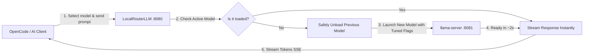

# LocalRouterLLM 🦙⚡

> **Smart On-Demand Model Router & VRAM Manager for Llama.cpp and Local AI Coding Agents.**  
> Automatically load, switch, and unload local GGUF models on demand with 0% idle VRAM overhead. Compatible with **OpenCode**, **Continue.dev**, **Aider**, **Cline**, and any OpenAI-compatible client.

---

[](LICENSE)
[](https://microsoft.com)
[](https://python.org)
[](https://github.com/ggerganov/llama.cpp)
[](https://platform.openai.com)

---

## 💡 The Problem

Running local LLMs on laptops or consumer GPUs (such as **NVIDIA RTX 3050, 3060, 4050, 4060 with 6GB–8GB VRAM**) is challenging:
* **VRAM Bottleneck:** You cannot load multiple models simultaneously in memory without crashing with *CUDA Out of Memory*.
* **Manual `.bat` Chaos:** You must manually close and open different batch scripts whenever you want to switch between a vision model (*Qwen3-VL*), a reasoning model (*Phi-4-mini / DeepSeek-R1*), or a general coding model.
* **Persistent VRAM Hogging:** If you leave `llama-server` running, it permanently hijacks 4–6 GB of VRAM even when you are not coding, starving other desktop apps, games, or wallpaper engines.

## 🚀 The Solution: LocalRouterLLM

**LocalRouterLLM** acts as an intelligent local proxy between your AI client (OpenCode, VS Code, etc.) and `llama-server.exe`:



### ✨ Key Features

* 🔄 **Zero-Touch Dynamic Switching:** Switch models inside OpenCode; LocalRouterLLM swaps them in VRAM automatically in ~2 seconds.
* 🛡️ **100% VRAM Protection:** Only one model lives in GPU memory at any given time.
* ⏳ **Generous Auto-Unload (40 min):** After 40 minutes of inactivity, the model automatically unloads from GPU memory, leaving your laptop 100% cool and quiet.
* 🦙 **System Tray Icon (Wallpaper Engine Style):**
  * 🟠 **Amber Dot:** Standby (0% VRAM used, ready for requests).
  * 🟢 **Cyan / Neon Green Dot:** Model actively loaded in GPU.
  * **Right-Click Menu:** Check status, 1-click instant VRAM flush, open OpenCode, or exit.
* ⚡ **Intel 12th/13th/14th Gen Hybrid CPU Tuned:** Pre-configured with optimal thread barriers (`--threads 6 --threads-batch 8`) to eliminate P-core / E-core latency stuttering.
* 🔌 **100% OpenAI API Compatible:** Implements `/v1/models`, `/v1/chat/completions`, and `/health` with full Server-Sent Events (SSE) streaming.

---

## 📦 Easy 1-Click Installation (Instalación Rápida)

### Option 1: Automatic Installer (Recommended)
1. Clone this repository:
   ```bash
   git clone https://github.com/YOUR_USERNAME/LocalRouterLLM.git
   cd LocalRouterLLM
   ```
2. Double-click **`install.bat`** (or run `powershell -ExecutionPolicy Bypass -File .\install.ps1`).
   * It checks Python.
   * Installs lightweight dependencies (`pystray`, `Pillow`).
   * Generates your `config.json`.
   * Optionally registers the automatic shell hook so typing `opencode` auto-spawns the router!

### Option 2: Manual Setup
```bash
pip install -r requirements.txt
cp config.example.json config.json
```

---

## 🎮 How to Use

### Starting LocalRouterLLM
Double-click **`start.bat`** or run:
```bash
pythonw router.py
```
The **Llama icon** will immediately appear in your Windows System Tray (next to your clock).

### Connecting with OpenCode
In your OpenCode configuration (`~/.config/opencode/opencode.json`):
```json
{
  "provider": {
    "llamacpp": {
      "npm": "@ai-sdk/openai-compatible",
      "options": {
        "baseURL": "http://127.0.0.1:8080/v1",
        "apiKey": "local"
      },
      "models": {
        "Qwen3.5-4B-Q4_K_M": {
          "name": "Qwen 3.5 4B Q4_K_M (32K)",
          "limit": { "context": 32768, "output": 4096 }
        },
        "Phi-4-mini-reasoning": {
          "name": "Phi 4 Mini Reasoning (32K)",
          "limit": { "context": 32768, "output": 4096 },
          "reasoning": true
        }
      }
    }
  }
}
```

Now open OpenCode, select any model, and start chatting. LocalRouterLLM handles the rest!

### Stopping / Freeing VRAM
* **Via System Tray:** Right-click the tray icon and select **⚡ Liberar VRAM ahora** (Free VRAM now) or **❌ Salir de LocalRouterLLM**.
* **Via Script:** Double-click **`stop.bat`**.

---

## ⚙️ Configuration (`config.json`)

Customize ports, timeouts, and models easily in `config.json`:

```json
{
  "server": {
    "host": "127.0.0.1",
    "port": 8080,
    "llama_port": 8081,
    "idle_timeout_minutes": 40
  },
  "llama_cpp": {
    "executable": "../bin/llama-b11065-bin-win-cuda-13.4-x64/llama-server.exe",
    "models_dir": "../gguf"
  },
  "models": {
    "Qwen3.5-4B-Q4_K_M": {
      "name": "Qwen 3.5 4B Q4_K_M - Multimodal (32K)",
      "model": "Qwen 3.5 4B Q4_K_M/Qwen3.5-4B-Q4_K_M.gguf",
      "mmproj": "Qwen 3.5 4B Q4_K_M/mmproj-F16.gguf",
      "ngl": "all",
      "ctx": 32768,
      "threads": 6,
      "threads_batch": 8,
      "flash_attn": true
    }
  }
}
```

---

## 🖥️ System Requirements
* **OS:** Windows 10 / 11 (x64)
* **Python:** 3.10+ (Miniconda / Anaconda or official Python)
* **Llama.cpp:** Windows build with CUDA (`llama-server.exe`)
* **Hardware Target:** Optimized for laptops & desktops with 6GB–16GB VRAM (e.g. RTX 3050 / 3060 / 4050 / 4060 / 4070)

---

## 📄 License
This project is licensed under the [MIT License](LICENSE). Feel free to use, modify, and contribute!
