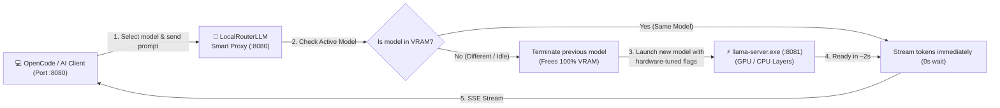

<div align="center">

# LocalRouterLLM 🦙⚡

**Smart On-Demand Model Router & VRAM Manager for Llama.cpp & Local AI Coding Agents**

[](LICENSE)
[](https://github.com/wTHE-HUNTERw/LocalRouterLLM/stargazers)
[](https://github.com/wTHE-HUNTERw/LocalRouterLLM/network/members)
[](https://github.com/wTHE-HUNTERw/LocalRouterLLM/issues)
[](https://microsoft.com)
[](https://python.org)
[](https://github.com/ggerganov/llama.cpp)
[](https://platform.openai.com)

<p align="center">
  <a href="#-the-problem">The Problem</a> •
  <a href="#-features">Features</a> •
  <a href="#-comparison">Comparison</a> •
  <a href="#-quick-start">Quick Start</a> •
  <a href="#-client-integrations">Clients</a> •
  <a href="#-configuration">Configuration</a> •
  <a href="#-versión-en-español">Español</a>
</p>

</div>

---

## 💡 The Problem

Running local LLMs on developer laptops or consumer desktops (**NVIDIA RTX 3050, 3060, 4050, 4060 with 4GB–8GB VRAM**) comes with major roadblocks:

1. **VRAM Bottleneck:** You cannot load multiple GGUF models simultaneously into VRAM without crashing into `CUDA Out of Memory`.
2. **The `.bat` File Nightmare:** Every time you want to switch between a vision model (*Qwen3-VL*), a coding model (*Qwen 3.5 4B*), or a reasoning model (*DeepSeek-R1 / Phi-4*), you have to manually find, close, and run different batch scripts.
3. **Persistent VRAM Starvation:** Leaving `llama-server.exe` running permanently hijacks 4–6 GB of VRAM even while you are not using it—choking games, 3D apps, browsers, and desktop engines like Wallpaper Engine.

---

## 🚀 The Solution: LocalRouterLLM

**LocalRouterLLM** is an ultra-lightweight, intelligent proxy service sitting between your AI coding agent (OpenCode, Continue.dev, Aider, Cline) and `llama-server.exe`:



---

## ✨ Features

- 🔄 **On-Demand Dynamic Model Switching:** Select any model in OpenCode or Continue; LocalRouterLLM swaps it into VRAM automatically in ~2 seconds.
- 🛡️ **Zero VRAM Leakage:** Only **one** model lives in GPU memory at a time. The previous model is cleanly killed, returning 100% of VRAM to Windows.
- ⏳ **Smart 40-Minute Idle Timeout:** If you step away from your computer, LocalRouterLLM unloads the model automatically, letting your laptop stay cool and silent.
- 🦙 **Interactive System Tray App (Wallpaper Engine Style):**
  - 🟠 **Amber Dot:** Standby (0% GPU VRAM used, listening for requests).
  - 🟢 **Cyan / Neon Green Dot:** Model actively loaded in GPU.
  - **Right-Click Menu:** Real-time model status, 1-click **"Liberar VRAM ahora"** flush button, open OpenCode, or quit.
- ⚡ **Intel Hybrid CPU Scheduling Optimization:** Specifically tuned for Intel 12th/13th/14th Gen hybrid processors (e.g. i5-12450HX, i7-13700H) with `--threads 6 --threads-batch 8` to eliminate P-Core / E-Core thread barrier penalties (saving up to 40% latency).
- 🔌 **100% OpenAI API Compatible:** Exposes `/v1/models`, `/v1/chat/completions`, and `/health` with full Server-Sent Events (SSE) streaming.
- 📦 **1-Click Installation:** Zero tedious setup. Run `install.bat` or `install.ps1`.

---

## 📊 Comparison

| Feature | LocalRouterLLM | Raw llama-server | Ollama | LM Studio |
| :--- | :---: | :---: | :---: | :---: |
| **Multi-model auto-switching** | ✅ **Automatic** | ❌ (1 model per server) | ✅ | ⚠️ (Manual / Semi) |
| **Custom Llama.cpp CLI flags** | ✅ **Full Control** | ✅ | ❌ (Abstracted) | ⚠️ (Limited) |
| **Intel P-Core / E-Core Tuning** | ✅ **Built-in** | ⚠️ (Manual config) | ❌ | ❌ |
| **Idle VRAM Unload** | ✅ **Configurable (40 min)** | ❌ (Permanent) | ✅ (5 min default) | ❌ |
| **Windows System Tray App** | ✅ **Native** | ❌ (Console window) | ⚠️ (Basic icon) | ⚠️ (Full GUI app) |
| **RAM / VRAM Overhead** | **~25 MB RAM (0% GPU)** | ~4-6 GB VRAM constant | ~300 MB background | ~800 MB background |

---

## 📦 Quick Start

### 1. Installation
Clone the repository:
```bash
git clone https://github.com/wTHE-HUNTERw/LocalRouterLLM.git
cd LocalRouterLLM
```

Run the 1-click installer:
```cmd
install.bat
```
*(Or in PowerShell: `.\install.ps1`)*

### 2. Configure Your Models
Open `config.json` and map your downloaded GGUF models:
```json
{
  "server": {
    "host": "127.0.0.1",
    "port": 8080,
    "llama_port": 8081,
    "idle_timeout_minutes": 40
  },
  "llama_cpp": {
    "executable": "../bin/llama-b11065-bin-win-cuda-13.4-x64/llama-server.exe",
    "models_dir": "../gguf"
  },
  "models": {
    "Qwen3.5-4B-Q4_K_M": {
      "name": "Qwen 3.5 4B Q4_K_M (32K)",
      "model": "Qwen 3.5 4B Q4_K_M/Qwen3.5-4B-Q4_K_M.gguf",
      "mmproj": "Qwen 3.5 4B Q4_K_M/mmproj-F16.gguf",
      "ngl": "all",
      "ctx": 32768,
      "threads": 6,
      "threads_batch": 8,
      "flash_attn": true
    }
  }
}
```

### 3. Run
Double click **`start.bat`**.  
The **Llama Icon** will immediately appear in your Windows notification tray!

---

## 🔌 Client Integrations

### 1. OpenCode Integration
In `~/.config/opencode/opencode.json`:
```json
{
  "provider": {
    "llamacpp": {
      "npm": "@ai-sdk/openai-compatible",
      "options": {
        "baseURL": "http://127.0.0.1:8080/v1",
        "apiKey": "local"
      },
      "models": {
        "Qwen3.5-4B-Q4_K_M": {
          "name": "Qwen 3.5 4B Q4_K_M - Multimodal (32K)",
          "limit": { "context": 32768, "output": 4096 }
        },
        "Phi-4-mini-reasoning": {
          "name": "Phi 4 Mini Reasoning (32K)",
          "limit": { "context": 32768, "output": 4096 },
          "reasoning": true
        }
      }
    }
  }
}
```

### 2. Continue.dev Integration (VS Code / JetBrains)
In `~/.continue/config.json`:
```json
{
  "models": [
    {
      "title": "Qwen 3.5 4B (Local)",
      "provider": "openai",
      "model": "Qwen3.5-4B-Q4_K_M",
      "apiBase": "http://127.0.0.1:8080/v1",
      "apiKey": "local"
    }
  ]
}
```

### 3. Curl / Python OpenAI SDK
```python
from openai import OpenAI

client = OpenAI(base_url="http://127.0.0.1:8080/v1", api_key="local")
response = client.chat.completions.create(
    model="Qwen3.5-4B-Q4_K_M",
    messages=[{"role": "user", "content": "Hello!"}],
    stream=True
)
for chunk in response:
    print(chunk.choices[0].delta.content or "", end="")
```

---

## 🇪🇸 Versión en Español

### ¿Qué es LocalRouterLLM?
**LocalRouterLLM** es un router inteligente y gestor de VRAM para Windows diseñado para programadores que utilizan modelos locales con **Llama.cpp** y clientes como **OpenCode**, **Continue.dev** o **Aider**.

### Beneficios Principales:
1. **Relevo Automático de VRAM:** Nunca más ejecutes archivos `.bat` manualmente. Cambias de modelo en OpenCode y el router descarga el anterior y monta el nuevo en ~2 segundos.
2. **0% VRAM en Reposo:** Si dejas de trabajar durante 40 minutos, el router libera automáticamente la memoria de la tarjeta gráfica para que tu laptop funcione fresca y silenciosa.
3. **Icono en la Bandeja del Sistema:** Control total junto al reloj de Windows (con botón para liberar VRAM en 1 clic).
4. **Optimizado para Procesadores Intel Híbridos:** Configurado con `--threads 6 --threads-batch 8` para exprimir al máximo los núcleos P-Core y evitar micro-congelamientos.

---

## 🤝 Contributing

Contributions are warmly welcome! Please see [CONTRIBUTING.md](CONTRIBUTING.md) for details.

1. Fork the repo: `https://github.com/wTHE-HUNTERw/LocalRouterLLM`
2. Create your feature branch (`git checkout -b feature/amazing-feature`)
3. Commit your changes (`git commit -m 'feat: add amazing feature'`)
4. Push to the branch (`git push origin feature/amazing-feature`)
5. Open a Pull Request

---

## 📄 License

Distributed under the **MIT License**. See [LICENSE](LICENSE) for more information.

---

<div align="center">
  <sub>Developed with ❤️ by <a href="https://github.com/wTHE-HUNTERw">wTHE-HUNTERw</a>.</sub>
</div>
